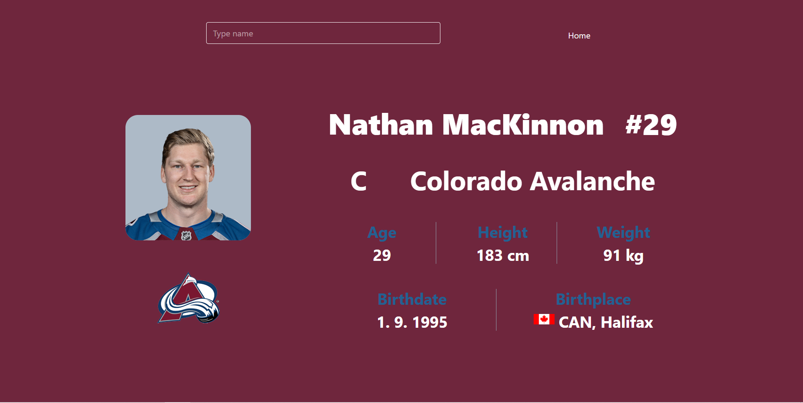

# NHL Players Register

A React + Express application that fetches and displays NHL player and team information from the NHL public API.

## Features
- Search for NHL players
- View detailed player information (photo, stats, birth info, team info)
- Responsive design with Tailwind CSS
- Backend proxy with Express to fetch data from the NHL API

## Tech Stack
- **Frontend:** React, Tailwind CSS
- **Backend:** Node.js, Express
- **Data Fetching:** Axios
- **API Source:** [NHL API](https://api-web.nhle.com)

## Tech Stack
- **Frontend:** React, Tailwind CSS
- **Backend:** Node.js, Express
- **Data Fetching:** Axios
- **API Source:** [NHL API](https://api-web.nhle.com)

## Dependencies
### Production
- `react` – UI library
- `react-dom` – React rendering for web
- `react-router-dom` – Routing for React
- `axios` – HTTP client for API calls
- `express` – Backend framework
- `cors` – Enable cross-origin requests

### Development
- `vite` – Frontend build tool
- `tailwindcss` – Utility-first CSS framework
- `autoprefixer` – CSS vendor prefixer (used by Tailwind)
- `postcss` – CSS processing
- `nodemon` – Auto-restart backend during development


## Preview

*Example of player detail view.*


## Getting Started

### 1. Install dependencies
```bash
npm install
